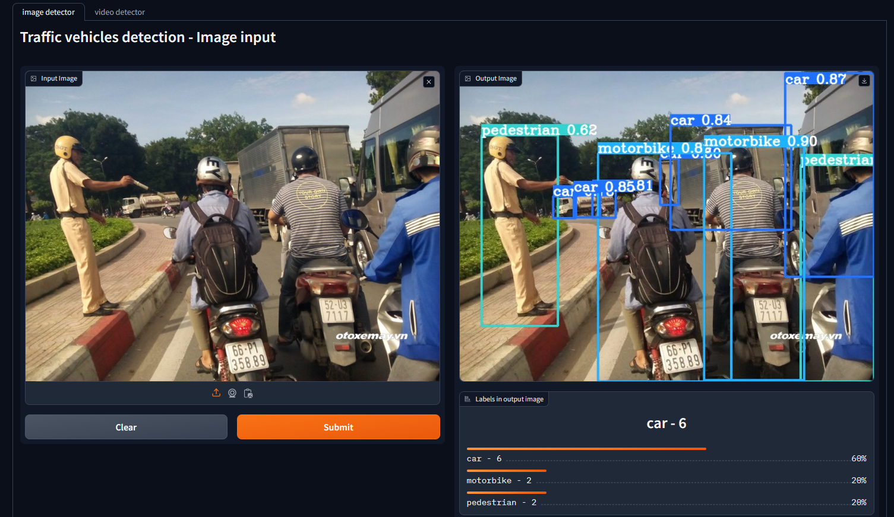
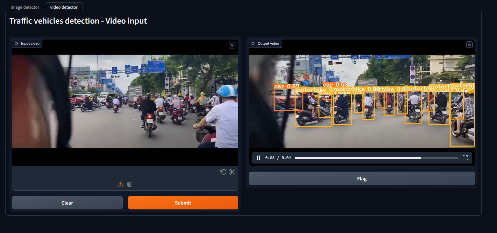
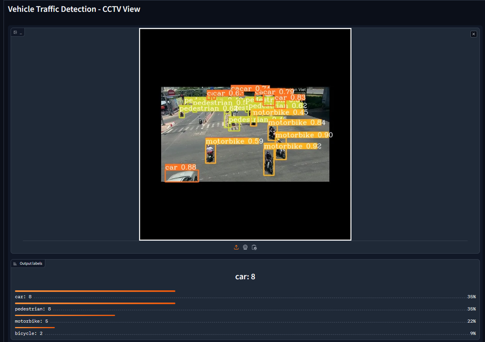

# Digital Image Processing project
### 1. Description
This project's main goal is learning how to using YoLoV6 model for vehicles detection and add custom datasets for YoLo model for better performance.  
### 2. Requirements
Most compatible Python version: `3.10.0`  
**Clone YoLoV6 github repo**  
```
git clone https://github.com/meituan/YOLOv6
```
Download this project's custom dataset trained model here: [Download](https://drive.google.com/drive/folders/18L8aAf-ILvC8F5uCio4Foct8W5azDkyb?usp=sharing) (Put in project ROOT directory)  
**Install requirements**  
```
pip install -r requirements.txt
```
**Run gradio index file** 
```
python index.py
```
### 3. Results
Vehicles and pedestrians recognition from images, with listing labels from output image.


Video input


View CCTV - Le Van Viet St. Crossroad with Vo Nguyen Giap St. (Thu Duc - Ho Chi Minh City)


To deploy a public URL that everyone can access, set `.launch(share = True)` in `index.py`
